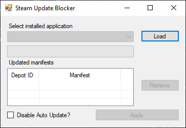
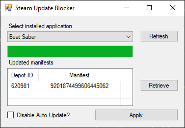

# SteamUpdateBlocker

Simple tool which *should* be able to trick Steam into thinking a game is fully updated, allowing you to use older versions of installed applications/games.

Inspired by [BeatSaber_UpdateSkipper](https://github.com/kinsi55/BeatSaber_UpdateSkipper) created by [kinsi55](https://github.com/kinsi55)

## Usage

1. Any game/application you want to block, ensure that auto updating is disabled (update on launch)

2. Any time an update is released, load the installed applications (click **Load**) and choose the game/application from the dropdown and then click **Retrieve**.

e.g: 

3. Apply the latest Manifest ID's using the aptly names **Apply** button.
*Optional*: Check the Disable Auto Update box to prevent automatic updates in the future (does the same thing as step 1).